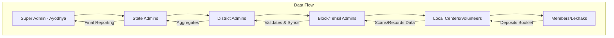

# Product Requirements Document (PRD): Ram Nam Mahadhan Sanchay Bank

## 1. Project Overview
**Project Name:** World Class Shri Ram Nam Mahadhan Sanchay Bank (विश्व स्तरीय श्री राम नाम महाधन संचय बैंक)  
**Organization:** Shri Jagannath OdiaBaba Sewa Sansthan, Ayodhya  
**Registration No:** IV 256/25  
**Vision:** To establish a spiritual "bank" where the "wealth" (Mahadhan) is the written name of Lord Rama. The goal is to reach every District, Tehsil, and Block in India, encouraging spiritual growth through the practice of Ram Nam Lekhan (writing the name of Rama).

### 1.1. Key Contact & Locations
- **Head Office (Mukhya Karyalaya):** Jagannath Ghat, Near Raj Ghat, Ayodhya, Uttar Pradesh - 224123.
- **Branch Office (Shakha Karyalaya):** Shri Siddha Baladevjeu, Tulasi Kshetra, Rathadanda, Kendrapada, Odisha - 754211.
- **Contact Numbers:** 8090525961, 9794640807, 6372858933, 7008367181, 9938103418, 7873981619.

---

## 2. Membership & Financial Details
The system will manage the following membership details as per the client's design:

### 2.1. Membership Types
- **Life Member:** Dedicated field in the membership card for life members with a unique number (नं.).
- **Regular Member/Lekhak:** Individuals registered for specific booklet writing tasks.

### 2.2. Official Bank Details (for Donations/Fees)
- **Account Name:** Shri Jagannath Odia Baba Sewa Sansthan
- **Bank Name:** Punjab National Bank (PNB)
- **Branch:** Nayaghat, Ayodhya
- **Account Number:** 3865002100006746
- **IFSC Code:** PUNB0386500

---

| Level | Managed By | Primary Responsibility |
| :--- | :--- | :--- |
| **National (Head Office)** | Super Admin | Overall monitoring, policy making, and central repository management. |
| **State Branch** | State Admin | Managing all District Branches within the state. |
| **District Branch** | District Admin | Managing all Block/Tehsil level branches within the district. |
| **Block/Tehsil Branch** | Block Admin | Direct interaction with members, booklet distribution, and collection. |
| **Member (Lekhak)** | Individual | Writing Ram Nam in booklets and depositing them. |

---

## 3. Key Features

### 3.1. Branch Management
- **Hierarchy Mapping:** Ability to create and link State -> District -> Block branches.
- **Branch Profiles:** Store contact details, location (GPS), and branch head information.
- **Digital Onboarding:** Online registration for new branch applications.

### 3.2. User & Member Management
- **Membership Cards/Passbooks:** Generation of digital and printable passbooks as per client design (500 units printing standard).
- **KYC/Profile Fields (as per Design):**
    - Name
    - Address
    - Post Office (PO)
    - Block
    - District
    - State
    - Pin Code
    - Mobile No
    - Signature (हस्ताक्षर)
- **Life Membership Serial Number:** Every Life Member card will have a unique manual/digital serial number (नं.).
- **Role-Based Access:** Different dashboards for Block, District, and State admins.

### 3.3. Ram Nam Mahadhan Management
- **Writing Kit (Member Kit):** Distribution of "Archana Pustika" (Yellow/Green booklets) along with specialized pens (as seen in Image 5).
- **Booklet Inventory:** Tracking the distribution of booklets to various centers.
- **Deposit Tracking:** Recording when a member completes and returns a booklet.
- **Spiritual Ledger:** A digital "Account Statement" showing the total count of Ram Nam deposited.

### 3.4. Reporting & Analytics
- **Live Counters:** Real-time counter of total Ram Nam names deposited across India.
- **Leaderboards:** Top contributing blocks/districts to encourage participation.
- **Status Updates:** Tracking booklet progress (Distributed -> Writing -> Deposited).

---

## 4. Technical Requirements
Based on standard premium tech stack requirements:

- **Frontend:** React Native (Mobile App for field workers/members) & Next.js (Web Dashboard for Admins).
- **Backend:** Node.js (API Layer).
- **Database:** Supabase (PostgreSQL for structured data, Auth for security).
- **Storage:** Supabase Storage for storing scanned copies of booklets or profile photos.
- **Notifications:** Push notifications and SMS for deposit confirmations.

---

## 5. UI/UX Design Goals
- **Theme:** Spiritual, Premium, and Cultural. Use Saffron, Gold, and Deep Red tones.
- **Accessibility:** Simple interface for elderly users and rural populations.
- **Multilingual Support:** Hindi, Odia, and English (as seen in the provided images).

---

## 6. Implementation Roadmap

### Phase 1: Foundation (MVP)
- Database schema design for hierarchy.
- Admin dashboard for Head Office.
- Member registration and digital ID card generation.

### Phase 2: Branch Rollout
- State, District, and Block admin login modules.
- Booklet inventory management system.

### Phase 3: Scaling & Spiritual Analytics
- Real-time deposit tracking.
- Mobile App for members to track their "Spiritual Wealth".
- Public-facing website with live counters.

---

## 7. System Architecture

---

## 8. Detailed User Flows

### 8.1. Member Onboarding
1. Member visits a Block Branch or Center.
2. Volunteer registers member via Mobile App using KYC fields.
3. Member receives a **Digital Membership ID** and a physical **Archana Pustika**.
4. Member's details are synced to the District and State databases.

### 8.2. Booklet Deposit Process
1. Member completes writing "Ram Nam" in the booklet.
2. Member returns the booklet to the Block Center.
3. Block Admin scans the booklet's unique ID.
4. System updates the member's "Ram Nam Account" with the count (e.g., 100,000 names).
5. A confirmation SMS/Notification is sent to the member.

---

## 9. Functional & Non-Functional Requirements

### 7.1. Functional Requirements
- **FR1: Hierarchical Admin Management:** Super Admin can create State Admins, who can create District Admins, and so on.
- **FR2: Digital Passbook Sync:** Physical passbook data must be digitizable via QR/Barcode scan.
- **FR3: Offline Data Entry:** Block-level volunteers must be able to record deposits without internet, with auto-sync when online.
- **FR4: Real-time Global Counter:** A public API/Widget showing the live total of Ram Nam deposits across the world.
- **FR5: Automated Certification:** Generate digital "Sree Ram Blessings" certificates for members upon reaching milestones (e.g., 1 Lakh names).

### 7.2. Non-Functional Requirements
- **NFR1: Scalability:** System must handle 10 Million+ members and Billions of "Ram Nam" entries.
- **NFR2: Availability:** 99.9% uptime using Supabase's global edge network.
- **NFR3: Security:** End-to-end encryption for member data and multi-factor authentication (MFA) for Admins.
- **NFR4: Performance:** Dashboard widgets must load in under 2 seconds even with massive datasets.

---

## 8. Advanced Technical Architecture

### 8.1. Tech Stack (Enterprise Grade)
- **Frontend (Web):** Next.js 14 with Server Actions for high-performance SEO-friendly dashboards.
- **Mobile (Cross-Platform):** React Native + Expo for quick deployment on Android/iOS.
- **Backend-as-a-Service:** **Supabase**
    - **PostgreSQL:** For complex relational queries (Hierarchy mapping).
    - **Edge Functions:** For real-time counter calculations and certificate generation.
    - **Realtime:** For live updates on the global "Ram Nam" counter.
- **Infrastructure:** Vercel for Web, Supabase for DB/Auth.

### 8.2. Security & Data Integrity
- **Role-Based Access Control (RBAC):** Row Level Security (RLS) in Supabase to ensure a District Admin can *only* see data from their own district.
- **Audit Trails:** Immutable logs for every deposit transaction (Who entered, When, Which booklet).
- **Data Backups:** Automated daily snapshots and point-in-time recovery.

---

## 9. Advanced Admin Modules

| Module | Features |
| :--- | :--- |
| **Super Admin Dashboard** | National analytics, State-wise performance, Financial audit, Global settings. |
| **Regional Dashboards** | Localized member growth tracking, Booklet inventory management, Volunteer verification. |
| **Volunteer App** | Simple UI for scanning booklets, registering members, and offline-to-online sync. |
| **Public Portal** | Live counters, "Hall of Devotion" (Top contributors), Branch locator map. |

---

## 10. Scalability & Future Roadmap

### 10.1. Data Sharding Strategy
As the "Ram Nam" entries grow into billions, we will implement table partitioning in PostgreSQL by **Year** and **Region** to maintain high query speeds.

### 10.2. Future Innovations
- **AI-Powered OCR:** Automatically scan handwritten "Ram Nam" booklets to verify the count and authenticity.
- **Virtual Darshan Integration:** Link member milestones to special digital experiences or live streams from Ayodhya.
- **Global Network:** Extending branches to international locations (Nepal, Mauritius, etc.).

---

## 11. Success Metrics (KPIs)
1.  **Branch Saturation:** Coverage in 100% of Indian Districts within 12 months.
2.  **Member Engagement:** Average 1 booklet deposit per member every 3 months.
3.  **Data Accuracy:** Zero discrepancies in manual vs. digital deposit records.
4.  **Uptime:** Maintaining system stability during high-traffic religious festivals.
